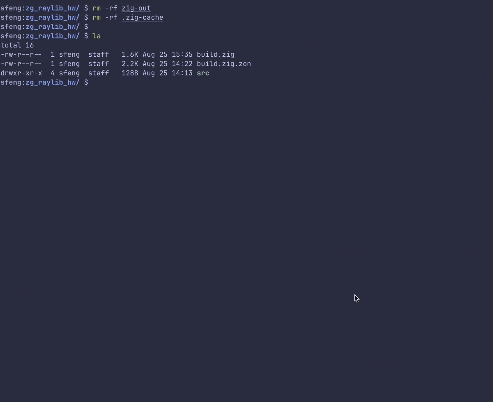

> Here I put some of my code when toying w/ ziglang

### Prerequisites

> Have [Zig](https://ziglang.org/download/) installed. 

I use `winget`, `homebrew`, and linux package manager of the distro's choice...

### Editing 

I'm using Neovide with Astronvim, easy to set up with community configured language pack...

### Building and Running

```bash
$ zig build run 
```

### Showcase


